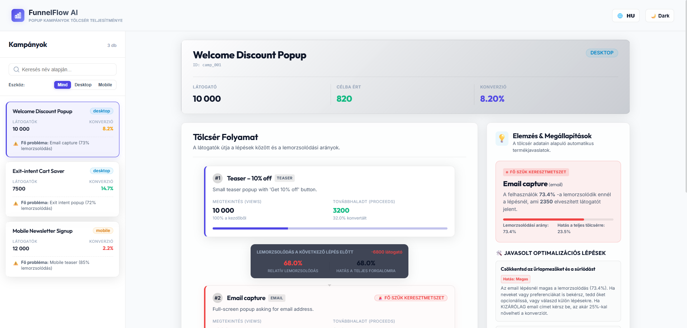
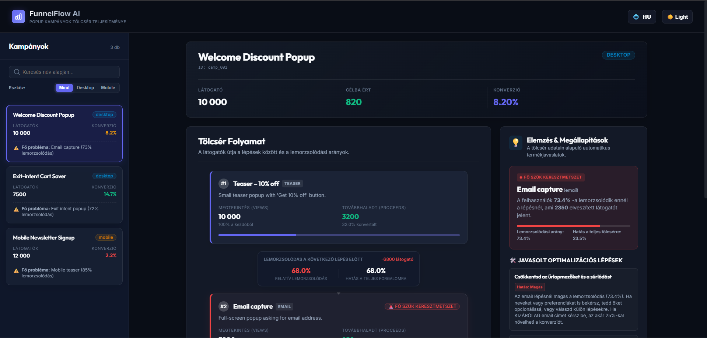

# FunnelFlow AI – Popup Funnel Analytics Dashboard

**Take-home Assignment – Junior AI Product Engineer**  
A conversion funnel visualizer and insights dashboard built for multi-step popup campaigns to easily spot and optimize marketing leaks.

---

## 📸 Screenshots / Képernyőképek





---

## 🌐 Quick Links / Gyors Linkek
- [English Documentation & Write-up](#english-version)
- [Magyar nyelvű dokumentáció és leírás](#magyar-valtozat)

---

# English Version

## 🚀 Getting Started

### Prerequisites
- **Node.js**: v18.0.0 or higher
- **npm**: v9.0.0 or higher

### Installation
Clone or extract the repository, navigate into the project directory, and install dependencies:
```bash
# Install dependencies
npm install
```

### Running the Application
To launch the hot-reloading development server locally:
```bash
# Run locally in development mode
npm run dev
```
Once started, the terminal will display the local address. Typically:
👉 **[http://localhost:5173/](http://localhost:5173/)** (Open this URL in your web browser).

### Building for Production
To verify compilation and create a production build bundle:
```bash
# Build project
npm run build
```
This generates the optimized static assets inside the `dist/` directory.

---

## 🎯 v1 Product Scope & Design Decisions

### 1. Problem Understanding
Marketers using popup tools like OptiMonk are often left in the dark. While they know their final conversion rate (e.g., 5%), they don't understand *where* visitors drop off in multi-step popups. For instance, a campaign might have a fantastic teaser click-through rate, but a high-friction email capture step kills the overall conversion. By highlighting **step-level relative drop-offs** and calculating the **absolute impact** of each step on the total traffic, this tool empowers marketers to instantly locate the funnel leak and act on it.

### 2. v1 Scope (What was built)
- **Interactive Campaign Explorer**: Search and filter campaigns by device (Desktop/Mobile). The sidebar displays total initial views, overall conversion, and a quick warning badge flagging the main bottleneck.
- **Vertical Pipeline Visualizer**: A visual step-by-step flow chart mapping views, proceeds, relative conversions, and absolute losses.
- **Critical Bottleneck Alerting**: Employs a pulsating red warning state (`pulse-hazard`) around the highest-drop-off step to make it impossible to miss.
- **Contextual Marketing Insights**: A rule-based engine that evaluates the type of the bottleneck (teaser, email capture, coupon, etc.) and suggests tailored CRO (Conversion Rate Optimization) fixes.
- **Simulated AI Deep-Dive**: An interactive widget showing a mock LLM auditing process (parsing logs, benchmarking industry standards) that generates detailed variant suggestions, psychological triggers, and optimized copywriting hooks.
- **Localization (HU/EN)**: A toggler in the header switches the entire interface (labels, cards, rules, mock reports) between Hungarian and English.
- **Responsive Premium Theme**: A dark/light theme switch powered entirely by a clean Vanilla CSS variables system.

### 3. What was left out of v1
- **Live Database / API**: Static JSON is used for mock campaigns. Real databases and API webhooks were excluded to keep the footprint small and fast to run.
- **Actual AI API Keys**: Simulated LLM generation is implemented. Connecting to live OpenAI/Gemini APIs requires backend servers and key management, which is over-scoped for a v1 frontend project.

---

## 🏛️ Architecture and Clean Code

The codebase is organized as a modern, type-safe Vue 3 SPA using TypeScript and Vite. It is structured to separate calculation logic, rule execution, and visual rendering (Single Responsibility Principle):

- **Data Layer (`src/data/campaigns.json`)**: Raw, static campaign JSON structures.
- **Analytical Math (`src/utils/funnelCalculator.ts`)**: Contains definitions of typescript types (`Campaign`, `CalculatedStep`, `FunnelMetrics`) and the calculation engine that processes raw counts into conversion ratios, absolute losses, and determines the bottleneck.
- **Rule Engine (`src/utils/recommendations.ts`)**: Decouples presentation from optimization logic, matching bottleneck attributes to target recommendations.
- **Components (`src/components/`)**:
  - `CampaignList.vue`: Lists and filters campaigns.
  - `FunnelChart.vue`: Maps the pipeline nodes and conversion bridges.
  - `InsightCard.vue`: Highlights the worst step and renders actionable tips.
  - `AISimulator.vue`: Simulates an AI assistant generating CRO experiments.
- **Styles (`src/style.css`)**: Implements the CSS custom property system for dark/light themes, layout structures, and glassmorphic micro-animations.

---

## 🤖 AI Usage Statement
During development, AI was used as an **active assistant**:
1. **TypeScript Boilerplate**: Prompted to generate strict TypeScript interfaces for the campaign data and computed metrics.
2. **CSS variables mapping**: Accelerated the writing of custom property lists and transition logic for the dark/light mode toggles.
3. **Copywriting & Recommendations**: Leveraged LLMs to draft realistic marketing suggestions and simulated AI recommendations in both Hungarian and English to ensure professional phrasing.

---

## 📈 Future Improvements (v2)
1. **Real-time API Integration**: Hook the app to live analytics APIs (e.g. OptiMonk Webhooks or Google Analytics) to stream event logs.
2. **Live LLM Integration**: Implement a lightweight Node.js/Serverless backend to feed the campaign statistics directly into Gemini 1.5 Flash, generating genuine, personalized visual and copy ideas.
3. **Variant A/B Test Launcher**: Allow users to click "Launch A/B Test" directly on the AI-proposed copy card to create and split traffic to Variant B inside their popup software.

---

# Magyar Változat

## 🚀 Futtatás Menete

### Előfeltételek
- **Node.js**: v18.0.0 vagy újabb
- **npm**: v9.0.0 vagy újabb

### Telepítés
Töltsd le vagy csomagold ki a repót, lépj a mappába, és telepítsd a csomagokat:
```bash
# Függőségek telepítése
npm install
```

### Alkalmazás indítása
A fejlesztői szerver elindításához futtasd:
```bash
# Fejlesztői szerver indítása
npm run dev
```
A terminálban megjelenik a helyi URL cím (általában: **[http://localhost:5173/](http://localhost:5173/)**). Nyisd meg ezt a böngésződben.

### Produkciós Build (Fordítás)
A kód típusellenőrzéséhez és tömörítéséhez futtasd:
```bash
# Projekt fordítása
npm run build
```
Ez a parancs létrehozza a statikus állományokat a `dist/` könyvtárban.

---

## 🎯 v1 Termék Terjedelem és Döntések

### 1. Termékprobléma Értelmezése
A webáruház tulajdonosok sokszor csak annyit látnak, hogy a felugró ablakos kampányaik konverziója alacsony (pl. 5%), de nem értik, hol akadnak el a látogatók a több-lépcsős folyamatokban. Egy teaser (kicsi felugró fül) remekül teljesíthet, de a következő email-bekérő mező elriaszthatja az embereket. Ez az alkalmazás megmutatja a **lépésenkénti relatív lemorzsolódásokat** és kiszámítja annak a **teljes forgalomra gyakorolt hatását**, így azonnal láthatóvá válik a legfőbb hibahely (szűk keresztmetszet).

### 2. v1 Scope (Mit valósítottunk meg)
- **Kampány böngésző**: Kereshető és eszköz (Desktop/Mobile) alapján szűrhető oldalsáv. Az elemeknél azonnal látszik a látogatószám, konverzió és a fő hibahely.
- **Tölcsér folyamat vizualizáció**: Vertikális csatornaként ábrázolt folyamatábra, amely lépésenként mutatja a megtekintéseket, a továbbhaladókat, a lemorzsolódottakat és az abszolút veszteséget.
- **Szűk keresztmetszet kiemelése**: A legrosszabb lépés lüktető piros jelzést (`pulse-hazard`) és figyelmeztető szöveget kap, így azonnal szembetűnő.
- **Marketing javaslatok**: Dinamikus CRO ajánlások a szűk keresztmetszet típusa (teaser, email, exit-intent, kupon) alapján.
- **Szimulált AI Asszisztens**: Egy kattintással elindítható AI elemzés. Vizuális folyamat-ticker mutatja az elemzés fázisait (adatok olvasása, benchmarkok ellenőrzése), majd A/B teszt javaslatot, másolható marketing szövegeket és pszichológiai trükköket generál.
- **Kétnyelvűség (HU/EN)**: A fejlécben lévő gombbal a teljes felület azonnal átváltható magyar vagy angol nyelvre.
- **Prémium sötét/világos mód**: Sima CSS változókkal működő modern téma-váltó.

---

## 🏛️ Architektúra és Clean Code irányelvek

A projekt egy tiszta, jól strukturált Single Page Application (SPA), amely Vue 3-ra és TypeScriptre épül:
- **Üzleti logika különválasztása (`src/utils/funnelCalculator.ts`)**: A tölcsér matematikai számításai és a szűk keresztmetszet keresés teljesen független a felülettől, külön modulban fut le (Clean Code - Single Responsibility).
- **Ajánlások motorja (`src/utils/recommendations.ts`)**: Leválasztja az optimalizációs szabályokat a komponensekről, könnyen bővíthetővé téve a szabályrendszert.
- **Komponensek (`src/components/`)**:
  - `CampaignList.vue` (Kampányok listázása és szűrése)
  - `FunnelChart.vue` (Folyamatábra és lemorzsolódási hidak)
  - `InsightCard.vue` (Azonnali CRO tippek)
  - `AISimulator.vue` (AI generátor widget)
- **Stílusok (`src/style.css`)**: Tiszta Vanilla CSS dizájnrendszer változókkal, üveg-hatású (glassmorphic) kártyákkal és finom árnyékokkal.

---

## 🤖 AI Használati Nyilatkozat
Az alkalmazás fejlesztése során az AI-t asszisztensként vontuk be a következő területeken:
1. **Típusok generálása**: Segített a TypeScript interfészek és adatstruktúrák gyors felvázolásában.
2. **CSS elrendezések**: Gyorsította a téma-váltó CSS változóinak és a flexibilis rácsok (grid) megírását.
3. **Szövegezés**: Biztosította a hiteles marketinges és termékfejlesztői kifejezések használatát a magyar és angol javaslatok megírásakor.

---

## 📈 Jövőbeli tervek (v2)
1. **Élő API kapcsolat**: Integráció analitikai webhookokkal (pl. OptiMonk, Segment, Google Analytics) az adatok élő frissüléséhez.
2. **Valódi Gemini API integráció**: Node.js backend közbeiktatásával az adatok közvetlen elküldése a Gemini 1.5 Flash modellnek, teljesen egyedi és valós idejű javaslatokért.
3. **Közvetlen A/B teszt indítás**: A felhasználó közvetlenül az AI kártyáról elindíthatná az optimalizált B variáns tesztelését a webshopban.
